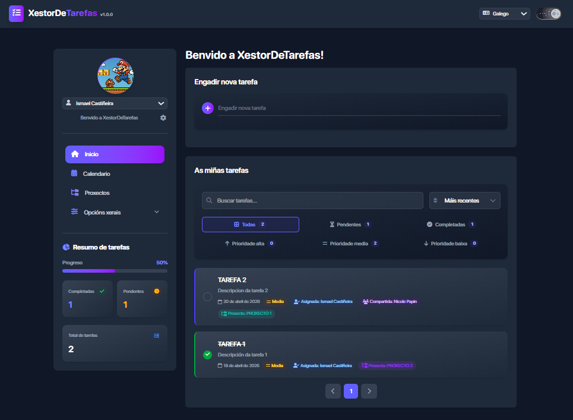

# XestorDeTarefas

Aplicación de xestión persoal de tarefas e proxectos feita con React + Redux Toolkit + Vite.

Inclúe multiusuario local, proxectos, calendario, internacionalización (`gl`/`es`/`en`), tema claro/escuro e lectura de credenciais KDBX de proxectos.



## Características actuais

- Xestión de tarefas: crear, editar, eliminar, completar, buscar, filtrar e ordenar.
- Campos de tarefa: título, descrición, tipo (`Tarefa` ou `Reunión`), prioridade, data límite, proxecto, asignación e compartición.
- Regras de formulario: na creación de tarefas todos os campos son obrigatorios agás data límite e compartir con.
- Xestión de usuarios en local (con rol admin) e cambio de usuario na barra lateral.
- Xestión de proxectos con datos de cliente.
- Vista de calendario anual/mensual.
- Integración KDBX (lectura de entradas por grupo/proxecto, só admin).
- Persistencia local e en ficheiro de datos mediante endpoints locais de Vite.
- Sincronización multi-dispositivo opcional con Firebase Firestore (mesmo estado compartido).

## Requisitos

- Node.js 18+ (recomendado 20+)
- npm
- Windows, Linux ou macOS

## Arranque en desenvolvemento

1) Instalar dependencias:

```bash
npm install
```

2) Iniciar aplicación:

```bash
npm run dev
```

3) Abrir no navegador:

- [http://localhost:5173](http://localhost:5173)

### Arranque rápido en Windows

Tamén podes usar o script `iniciar-app.bat` na raíz do proxecto, que:

- abre o servidor Vite nunha consola nova,
- e abre automaticamente o navegador.

## Scripts dispoñibles

- `npm run dev` - servidor de desenvolvemento.
- `npm run build` - build de produción.
- `npm run preview` - previsualización da build.
- `npm run lint` - lint do código.

## Configuración de datos locais

- `app-config.json`: garda a ruta do ficheiro de datos.
- `app-data.json`: almacena estado persistido da app (ignorado en git).
- `vite.config.js` expón endpoints locais:
  - `GET/POST /api/app-data-config`
  - `GET/POST /api/app-data`
  - `POST /api/kdbx/read`

## Modo multiusuario real (Firebase)

Para usar a mesma app desde dous ordenadores/móbiles e compartir cambios:

1) Crea un proxecto en Firebase e activa Firestore.
2) Enche cos datos necesarios o arquivo `.env.example` na raíz do proxecto e renomeao a `.env`.
4) Arranca a app (`npm run dev` ou `iniciar-app.bat`) nos dispositivos que queiras.

Ao ter Firebase configurado, a app usa Firestore como persistencia principal e sincroniza cambios entre sesións.  
Se non hai configuración de Firebase, segue funcionando no modo local de sempre.

## KDBX (KeePass)

- A lectura de KDBX está dispoñible desde Proxectos e restrinxida a usuario admin.
- Requírese ruta e contrasinal válidas.
- A base KDBX con Argon2 está soportada na execución local do proxecto.

## Despregamento

Para funcionalidade completa (incluíndo KDBX e persistencia por ficheiro), precisa un entorno que execute Node.js.

## Estrutura xeral

```text
src/
  App/                # Store e persistencia
  Components/         # UI por áreas (Tasks, Projects, Layout, Options...)
  Features/           # Slices Redux (Tasks, Users, Projects, Theme, Language)
  i18n/               # Traducións
vite.config.js        # Configuración Vite + endpoints locais
```

## Tecnoloxías

- React 19
- Redux Toolkit
- Vite 6
- Tailwind CSS 4
- Framer Motion
- MUI
- kdbxweb

## Licenza

MIT. Ver `LICENSE`.

## Autor

[Ismael Castiñeira](https://ipardelo.es)

```bash
VIVA GHALISIA E A COSTA DA MORTE! 💀
```