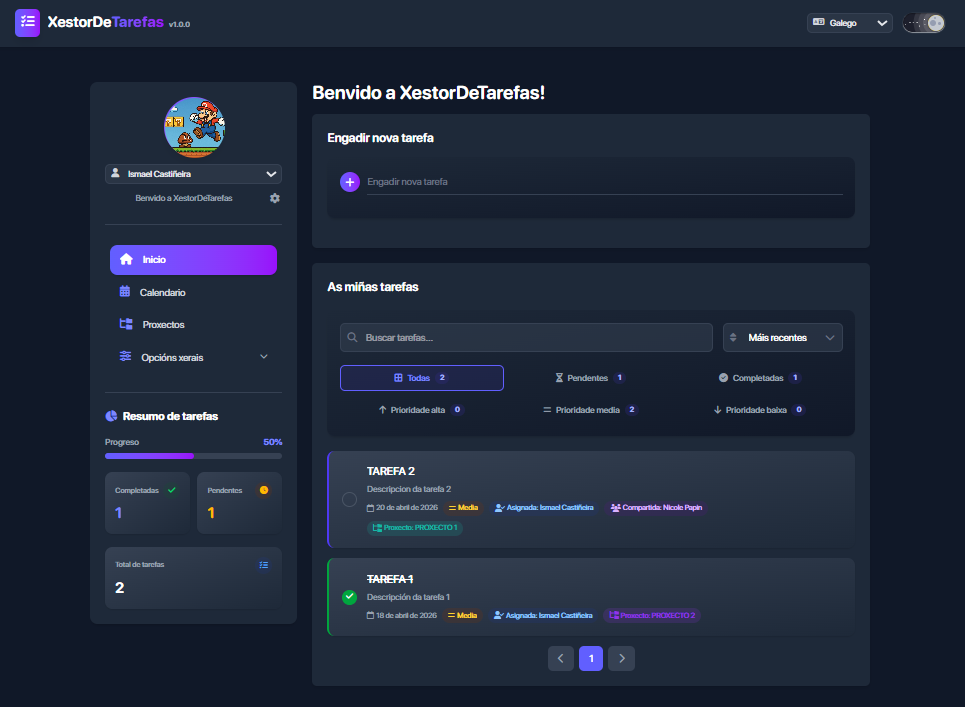

<div align="center">


<br>

**Aplicación de xestión persoal de tarefas e proxectos**

Planifica o teu día, crea e completa tarefas, agrupa o traballo por proxectos e cliente,
garda notas e listas de comprobación, e revisa todo no calendario — no ordenador ou no
móbil, sincronizado entre dispositivos e detrás do teu propio inicio de sesión. Sen subscrición, sen anuncios, cos teus datos na túa propia Firebase.

<br>

[](LICENSE)
[](https://nodejs.org)
[](https://github.com/IPardelo/xestor-de-tarefas-app)




</div>

## Por que

As aplicacións de tarefas comerciais pídenche unha conta nun servidor alleo, gardan os teus
datos onde non ves, e tarde ou cedo poñen detrás dun pago o que antes era gratis.
XestorDeTarefas nace da idea contraria: **a app é túa e os datos tamén**.

- Os datos viven no teu propio proxecto de Firebase, non nun servizo de terceiros.
- Todo nun só sitio: tarefas, proxectos con cliente, notas e calendario, sen saltar entre apps.
- O mesmo estado no ordenador e no móbil, sincronizado ao instante.
- Pensada en galego dende o primeiro día (e tamén en castelán e inglés).
- Sen subscrición, sen anuncios, sen límites artificiais. Código aberto con licenza MIT.

## Funcionalidades

- ✅ Xestión de tarefas: crear, editar, eliminar, completar, buscar, filtrar e ordenar.
- 📝 Módulo de notas: notas de texto e notas tipo lista/checklist con cor personalizada.
- 📌 Ordenación de notas por fixación e última actualización.
- 👥 Xestión de usuarios.
- 📁 Xestión de proxectos con datos de cliente.
- 📅 Vista de calendario anual/mensual con sincronización con Google Calendar.
- 🔥 Persistencia e sincronización con Firebase Firestore (estado compartido).
- 🔑 Lectura de credenciais KDBX (KeePass) dos proxectos, restrinxida a admin.

## Configuración

### Requisitos

- Node.js 18+ (recomendado 20+)
- npm
- Windows, Linux ou macOS

### 🔥 Firebase

Para usar a mesma app desde dous ordenadores/móbiles e compartir cambios:

1) Crea un proxecto en Firebase e activa Firestore.
2) Enche cos datos necesarios o arquivo `.env.example` na raíz do proxecto e renomeao a `.env`.
4) Arranca a app (`npm run dev` ou `iniciar-app.bat`) nos dispositivos que queiras.

A app usa Firestore como persistencia principal e sincroniza cambios entre sesións.

### 🔒 KDBX (KeePass)

- A lectura de KDBX está dispoñible desde Proxectos e restrinxida a usuario admin.
- Requírese ruta e contrasinal válidas.
- A base KDBX con Argon2 está soportada na execución local do proxecto.

## Estrutura xeral

```text
src/
  App/                # Store e persistencia
  Components/         # UI por áreas (Tasks, Projects, Layout, Options...)
  Features/           # Slices Redux (Tasks, Users, Projects, Theme, Language)
  i18n/               # Traducións
vite.config.js        # Configuración Vite + endpoint local de KDBX
```

## Evolución por versión

### v2.1.0

- Visualización por días no calendario
- Melloras visuais en todos os módulos

### v2.0.0

- Novo módulo de **Notas**.
- Accións en notas: crear, editar, eliminar, fixar e marcar ítems.

### v1.1.0

- Melloras de UI e organización da app para uso diario.
- Compoñenente de login.
- Integración co calendario de Google.

### v1.0.0

- Base da aplicación de xestión de tarefas.
- Crear, editar, eliminar e completar tarefas.
- Filtros, busca e ordenación de tarefas.
- Persistencia local no dispositivo.
- Soporte de tema claro/escuro e internacionalización inicial (`gl`/`es`/`en`).
- Ampliación funcional con módulo de proxectos.
- Xestión de usuarios en local con rol administrador.
- Vista de calendario anual/mensual.

## Autor

[Ismael Castiñeira](https://ipardelo.es)

```bash
VIVA GHALISIA E A COSTA DA MORTE! 💀
```